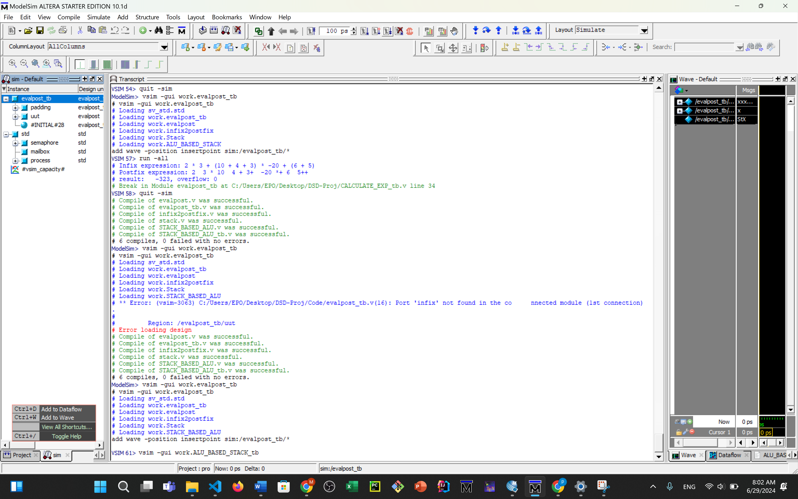

#Mohammadfarhan Bahrami--STD id 401105729
# Midterm-Q7

This repository contains Verilog code for a simple processor and its testbench. This guide will help you set up ModelSim and VSCode to run and simulate Verilog code.

## Tools Required

1. **ModelSim**: A powerful HDL simulation environment.
2. **VSCode**: A versatile code editor with support for many programming languages and tools.

## Setting Up

### ModelSim

1. **Download and Install ModelSim**
   - Visit the [ModelSim website](https://www.mentor.com/products/fv/modelsim) and download the appropriate version for your operating system.
   - Follow the installation instructions.

2. **License Setup**
   - Ensure you have a valid license for ModelSim. Follow the instructions provided during installation to set up the license.

### VSCode

1. **Download and Install VSCode**
   - Visit the [VSCode website](https://code.visualstudio.com/) and download the appropriate version for your operating system.
   - Follow the installation instructions.

2. **Install Extensions**
   - Open VSCode and go to the Extensions view by clicking on the Extensions icon in the Activity Bar on the side of the window.
   - Install the following extensions:
     - **Verilog HDL Support**: Adds syntax highlighting and snippets for Verilog HDL.
     - **ModelSim Integration** (optional): For integrated support with ModelSim.

## Repository Structure

- `Code/`: Contains Verilog source files.
- `Document/`: Contains report as PDF and docx.
- `Miscellaneous/`: Contains ModelSim project files and screenshots.
- `README.md`: This file.

## Running Simulations

### Using ModelSim

1. **Open ModelSim**
   - Launch ModelSim from your application menu or command line.

2. **Create a New Project**
   - Go to `File > New > Project`.
   - Enter a project name and specify a location.
   - Add existing files from the `Code/` directory to the project.
   - 

3. **Compile the Code**
   - In the ModelSim window, go to `Compile > Compile All`.
   - 

4. **Run the Simulation**
   - Go to `Simulate > Start Simulation`.
   - Select the testbench module (e.g., `TB.v`) from the `Code` directory.
   - Run the simulation and view the waveforms in the waveform window.
   - 

### Using VSCode

1. **Open the Repository**
   - Open VSCode and select `File > Open Folder`.
   - Navigate to the directory where you cloned this repository and open it.
   - 


2. **Edit Verilog Files**
   - Open the Verilog files in the `Code/` directory for editing.
   - Use the Verilog HDL Support extension for syntax highlighting and code snippets.

## Example Usage

### Example Testbench (`Code/TB.v`)

Here's a quick overview of a sample testbench included in this repository:

```verilog
module processor_tb;

  reg clk;
  reg rst;
  reg [12:0] instruction;
  wire [511:0] A [0:3];

  processor uut (
    .clk(clk),
    .rst(rst),
    .instruction(instruction),
    .A(A)
  );

  initial begin
    clk = 0;
    rst = 1;
    instruction = 13'b0;
    $monitor("Time=%0t, instruction=%b, A[0]=%h, A[1]=%h, A[2]=%h, A[3]=%h", 
             $time, instruction, A[0], A[1], A[2], A[3]);
    #5 rst = 0;
    #5 rst = 1;
    #10;
    instruction = 13'b100_00_000000000; 
    #10;
    instruction = 13'b000_00_000000001; 
    #10;
    instruction = 13'b100_01_000000010; 
    #10;
    instruction = 13'b000_00_000000001; 
    #10;
    instruction = 13'b000_00_000000000; 
    #10;
    instruction = 13'b100_00_000000011; 
    #10;
    instruction = 13'b000_00_000000001; 
    #10;
    instruction = 13'b100_01_000000100; 
    #10;
    instruction = 13'b000_00_000000001; 
    #10;
    instruction = 13'b001_00_000000000; 
    #10;
    instruction = 13'b110_10_000000101; 
    #10;
    instruction = 13'b101_00_000000101; 
    #10;
    instruction = 13'b000_00_000000001; 
    #10;
    $finish;
  end

  always #5 clk = ~clk;

endmodule
```
### The result of this example is

## Authors 
-- [Mohammadfarhan Bahrami](https://github.com/EPO004)
