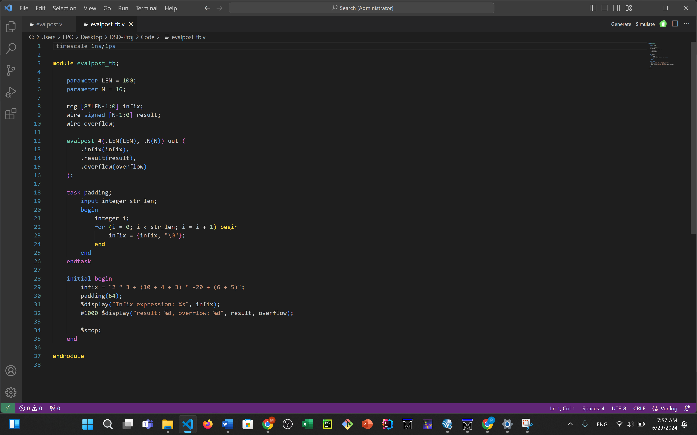
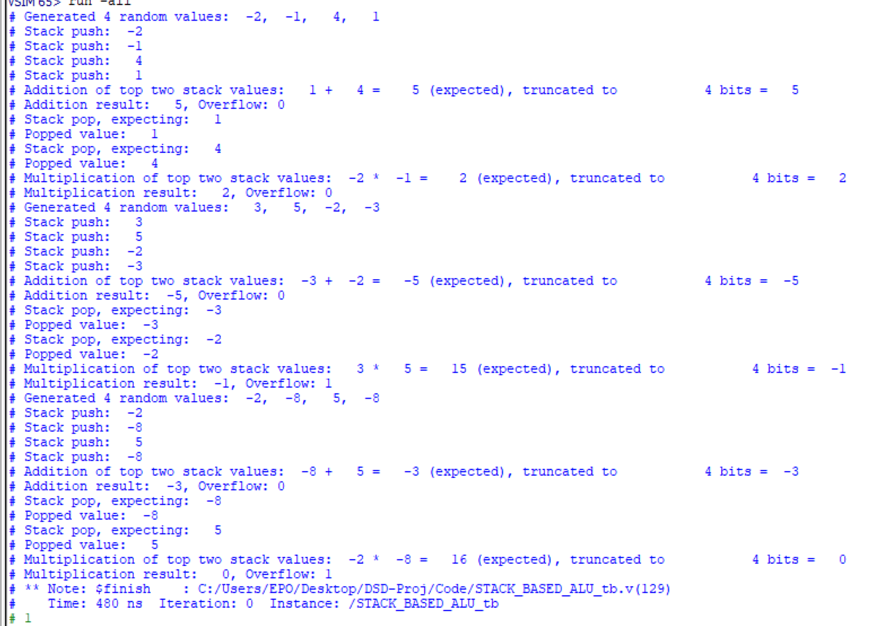

#Mohammadfarhan Bahrami--STD id 401105729
# Midterm-Q1

## Table of Contents

  - [Tools_Required](#Tools_Required)
  - [Setting_Up](#Setting_Up)
  - [Repository Structure](#Repository_Structure)
  - [Running_Simulations](#Running_Simulations)
  - [Modules](#Modules)
  - [Example_Usage](#Example_Usage)
  - [Authors](#Authors)

This repository contains Verilog code for a simple processor and its testbench. This guide will help you set up ModelSim and VSCode to run and simulate Verilog code.

## Tools_Required

1. **ModelSim**: A powerful HDL simulation environment.
2. **VSCode**: A versatile code editor with support for many programming languages and tools.

## Setting_Up

### ModelSim

1. **Download and Install ModelSim**
   - Visit the [ModelSim website](https://www.mentor.com/products/fv/modelsim) and download the appropriate version for your operating system.
   - Follow the installation instructions.

2. **License Setup**
   - Ensure you have a valid license for ModelSim. Follow the instructions provided during installation to set up the license.

### VSCode

1. **Download and Install VSCode**
   - Visit the [VSCode website](https://code.visualstudio.com/) and download the appropriate version for your operating system.
   - Follow the installation instructions.

2. **Install Extensions**
   - Open VSCode and go to the Extensions view by clicking on the Extensions icon in the Activity Bar on the side of the window.
   - Install the following extensions:
     - **Verilog HDL Support**: Adds syntax highlighting and snippets for Verilog HDL.
     - **ModelSim Integration** (optional): For integrated support with ModelSim.

## Repository_Structure

- `Code/`: Contains Verilog source files.
- `Document/`: Contains report as PDF and docx.
- `Miscellaneous/`: Contains ModelSim project files and screenshots.
- `README.md`: This file.

## Running_Simulations

### Using ModelSim

1. **Open ModelSim**
   - Launch ModelSim from your application menu or command line.

2. **Create a New Project**
   - Go to `File > New > Project`.
   - Enter a project name and specify a location.
   - Add existing files from the `Code/` directory to the project.
   - 

3. **Compile the Code**
   - In the ModelSim window, go to `Compile > Compile All`.
   - 

4. **Run the Simulation**
   - Go to `Simulate > Start Simulation`.
   - Select the testbench module (e.g., `TB.v`) from the `Code` directory.
   - Run the simulation and view the waveforms in the waveform window.
   - 

### Using VSCode

1. **Open the Repository**
   - Open VSCode and select `File > Open Folder`.
   - Navigate to the directory where you cloned this repository and open it.
   - 


2. **Edit Verilog Files**
   - Open the Verilog files in the `Code/` directory for editing.
   - Use the Verilog HDL Support extension for syntax highlighting and code snippets.


## Modules

### stack

This module implements a simple stack data structure in Verilog. It supports basic operations such as push and pop, along with maintaining full and empty status flags. The stack size and data width are parameterized.

- **Inputs:**
  - `clk`: Clock signal.
  - `rst`: Reset signal.
  - `push`: Input signal to push data onto the stack.
  - `pop`: Input signal to pop data from the stack.
  - `data_in`: Input data to be pushed onto the stack.

- **Outputs:**
  - `data_out`: Output data popped from the stack.
  - `full`: High when the stack is full.
  - `empty`: High when the stack is empty.

- **Parameters:**
  - `N`: Width of the data bus.
  - `MAX_SIZE`: Maximum capacity of the stack.

- **Usage:**
  Describe how to instantiate and use the `stack` module in other designs.

### STACK_BASED_ALU

This module integrates the stack module (`stack`) with an ALU (Arithmetic Logic Unit) to perform stack-based arithmetic operations. It handles pushing and popping data from the stack based on an opcode input.

- **Inputs:**
  - `clk`: Clock signal.
  - `rst`: Reset signal.
  - `opcode`: Control signal for selecting arithmetic operations (addition, multiplication) or stack operations (push, pop).
  - `input_data`: Input data for arithmetic operations.

- **Outputs:**
  - `output_data`: Result of arithmetic operations.
  - `overflow`: Indicates arithmetic overflow.
  - `success`: Indicates successful operation completion.

- **Parameters:**
  - `N`: Width of the data bus.
  - `MAX_SIZE`: Maximum capacity of the stack (parameter passed to `stack` module).

- **Usage:**
  Provide an example of how to instantiate and use `STACK_BASED_ALU` with sample test cases.

### STACK_BASED_ALU_tb

Testbench module for verifying the functionality of `STACK_BASED_ALU`. It generates stimuli, applies them to the module under test (`STACK_BASED_ALU`), and checks the outputs for correctness.

- **Purpose:**
  - Verify stack operations (push, pop).
  - Verify arithmetic operations (addition, multiplication).
  - Check for overflow conditions.

- **Inputs and Outputs:**
  - List all input and output signals used in the testbench.

- **Simulation Flow:**
  Briefly explain the sequence of events in the testbench simulation.

### infix2postfix

This module converts an infix expression to a postfix expression using a stack data structure. It reads an infix expression and outputs the corresponding postfix expression.

- **Inputs:**
  - `infix_expr`: Input infix expression.

- **Outputs:**
  - `postfix_expr`: Output postfix expression.

- **Parameters:**
  - `LEN`: Length of the expression in characters (parameter passed to `stack` module).

- **Operation:**
  Describe the algorithm used to convert infix to postfix notation.

### evalpost

Module to evaluate a postfix expression using the `STACK_BASED_ALU` module. It processes each token in the postfix expression, performs the corresponding arithmetic or stack operation, and outputs the final result.

- **Inputs:**
  - `infix_expr`: Input infix expression.

- **Outputs:**
  - `result`: Result of evaluating the postfix expression.
  - `overflow`: Indicates arithmetic overflow (if any).

- **Operation:**
  Explain the process of tokenizing and evaluating the postfix expression.
  
### evalpost_tb 

The `evalpost_tb` module serves as a testbench for validating the functionality of the `evalpost` module, which evaluates infix expressions converted to postfix notation.

- **Inputs:**
  - `infix`: A reg of size `[8*LEN-1:0]`, representing the infix expression to evaluate.

- **Outputs:**
  - `result`: A wire of size `[N-1:0]`, holds the signed integer result of the postfix evaluation.
  - `overflow`: A wire indicating overflow during evaluation.

## Example_Usage

### Example Testbench (`Code/evalpost_tb.v`)

Here's a quick overview of a sample testbench included in this repository:

```verilog
`timescale 1ns/1ps

module evalpost_tb;

    parameter LEN = 100; 
    parameter N = 16;   

    reg [8*LEN-1:0] infix;
    wire signed [N-1:0] result;
    wire overflow;

    evalpost #(.LEN(LEN), .N(N)) uut (
        .infix(infix),
        .result(result),
        .overflow(overflow)
    );

    task padding;
        input integer str_len;
        begin
            integer i;
            for (i = 0; i < str_len; i = i + 1) begin
                infix = {infix, "\0"};
            end
        end
    endtask

    initial begin
        infix = "2 * 3 + (10 + 4 + 3) * -20 + (6 + 5)";
        padding(64);
        $display("Infix expression: %s", infix);
        #1000 $display("result: %d, overflow: %d", result, overflow);
        
        $stop;
    end

endmodule

```
### The result of this example after simulating in ModelSim is


### And also for another testbench STACK_BASED_ALU_tb we have the result



## Authors 
  - [Mohammadfarhan Bahrami](https://github.com/EPO004)
